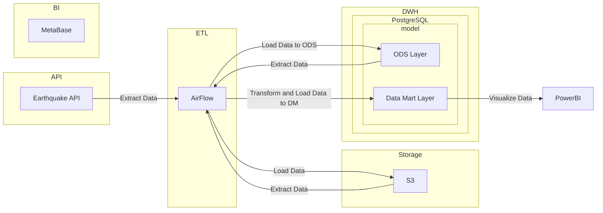
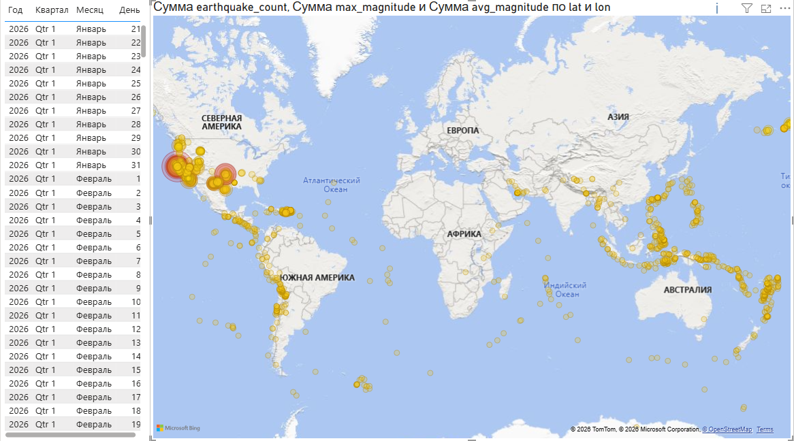
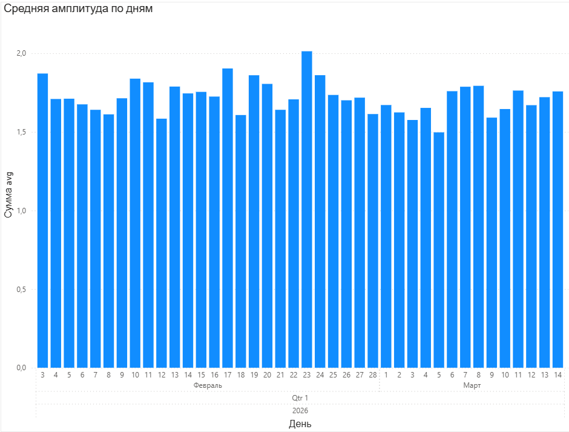

<<<<<<< HEAD
# Earthquake Data Pipeline & Visualization
Проект представляет собой полный ETL-пайплайн для сбора, обработки и визуализации данных о землетрясениях.
Данные загружаются из внешнего API, сохраняются в S3-хранилище, обрабатываются через Airflow и загружаются в PostgreSQL. На основе подготовленных витрин строятся интерактивные дашборды.
## Архитектура проекта

=======
# earthquakecommit 
>>>>>>> f1d3bc7 (добавил дашборды)
